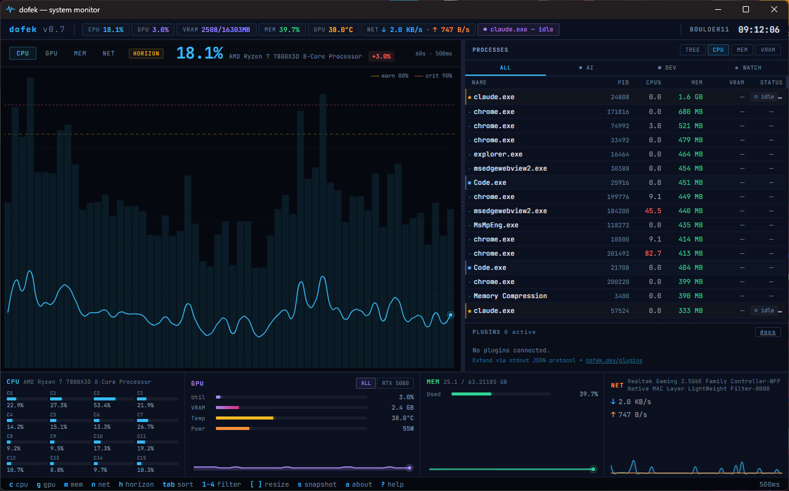
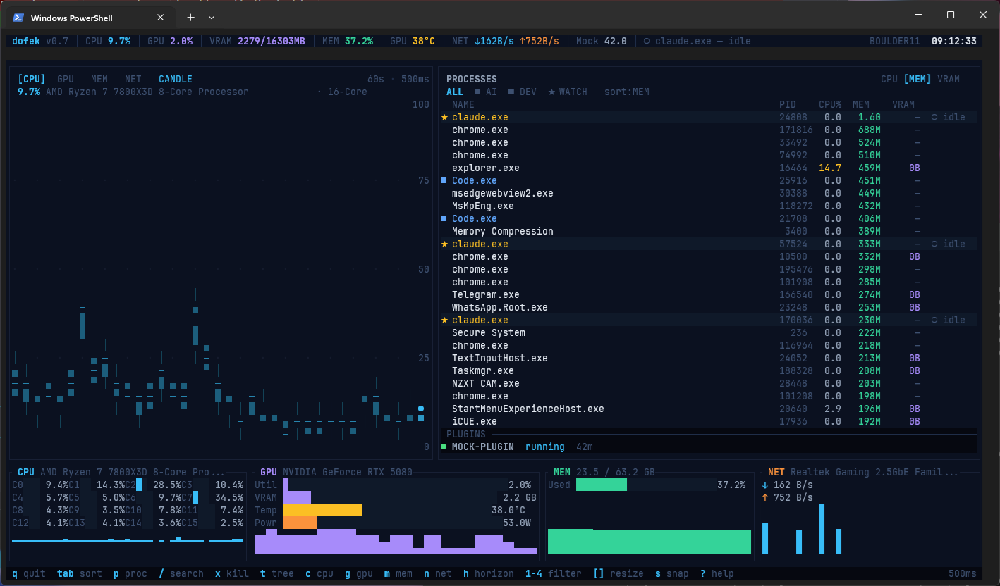
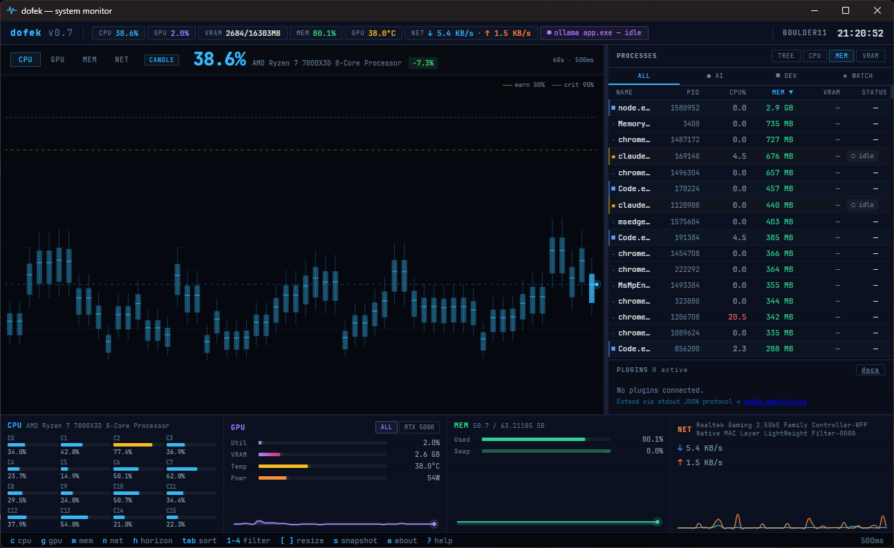
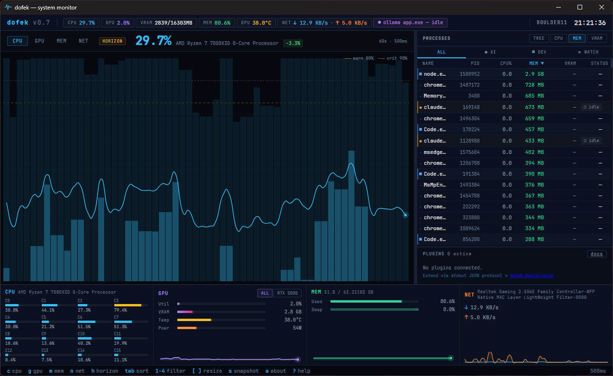

# dofek

**GUI and Terminal-native, AI-aware system monitor for Windows and Linux.**

[](./LICENSE)
[](https://github.com/AsafSaar/dofek/releases)
[](https://github.com/AsafSaar/dofek/releases)
[](https://github.com/AsafSaar/dofek/actions)

> *dofek* (Hebrew: דּוֹפֶק) means "pulse" or "heartbeat"

Most system monitors were designed before LLMs ran locally. They treat GPU as an afterthought and VRAM as a footnote. dofek is built for the developer who has `ollama` running in the background, is watching a model load into VRAM, and needs to know at a glance whether their system can handle the next task.

## Screenshots

**GUI** — Tauri desktop app:



**TUI** — terminal interface:



<details>
<summary>More GUI views</summary>




</details>

<details>
<summary>ASCII layout reference</summary>

```
dofek v1.1  CPU 9.7%  GPU 1.0%  VRAM 1700/16303MB  MEM 34.0%  TEMP 36C    BOULDER11  07:33:40
-----------------------------------------------------------------------------------------------
 [CPU]  GPU  MEM  NET   CANDLE                                 PROCESSES        CPU [MEM] VRAM
 9.7% AMD Ryzen 7 7800X3D 8-Core - 16-Core    -- warn 80%      ALL  AI  DEV  WATCH    sort:MEM
                                                -- crit 90%    NAME       PID  CPU%  MEM  VRAM
           ___   _                                             node.exe  35488  0.0 2.3G    --
    ___ __|   |_| |  _     _                                   vmmem     17252  0.0 1.8G    --
   |   |  |   | | |_| |___| |__                                claude..  13596  2.8 1.1G    --
                                                               chrome..  29328  0.5 689M    --
   Candlestick chart area (CPU)                                claude..  25180  0.0 668M    --
   with threshold lines at 80/90%                              chrome..  25252  1.6 441M    --
                                                               MsMpEng   5168   0.0 433M    --
                                                               Code.exe  21356  0.4 425M    --
                                                               explor..  12412  6.1 415M    --
                                                               Code.exe  20380  0.0 402M    --
                                                               ...more processes...
                                                               PLUGINS ---
                                                               No plugins connected
-----------------------------------------------------------------------------------------------
 CPU AMD Ryzen 7 7800X    | GPU NVIDIA RTX 5080   | MEM 21.5/63.2 GB     | NET Hyper-V Virtual
 C0 15% C1 13% C2 19%     | Util     1.0%         | Used [###..] 34.0%   | down 0 B/s
 C3  9% C4 10% C5 12%     | VRAM     1.7 GB       | Swap [.....] 0.0%    | up   0 B/s
 C6 15% C7 12% C8  5%     | Temp    36.0 C        |                      |
-----------------------------------------------------------------------------------------------
 q quit  tab sort  p proc  / search  x kill  c cpu  g gpu  m mem  n net  1-4 filter  ? help  500ms
```

</details>

## Download

Pre-built binaries are published on the [Releases page](https://github.com/AsafSaar/dofek/releases/latest):

**Windows (x64):**

| Asset | Description |
| --- | --- |
| `dofek_*.msi` | Desktop GUI installer — bundles both TUI and GUI |
| `dofek-tui.exe` | Standalone TUI binary, no installer |

**Linux (x86_64):**

| Asset | Description |
| --- | --- |
| `dofek_*.deb` | Debian / Ubuntu package — bundles both TUI and GUI |
| `dofek_*.rpm` | Fedora / RHEL / openSUSE package |
| `dofek_*.AppImage` | Universal portable binary (`chmod +x` and run) |
| `dofek-tui` | Standalone TUI binary, no installer |

`SHA256SUMS.txt` has checksums for every artifact.

> ⚠️ **Binaries are currently unsigned.** On Windows, SmartScreen may flag the installer (right-click → Properties → "Unblock"). On Linux, AppImages need `chmod +x` before running.

Verify (Windows): `Get-FileHash .\dofek_1.1.0_x64_en-US.msi -Algorithm SHA256`
Verify (Linux): `sha256sum -c SHA256SUMS.txt`

## Features

- **Dual interface** — terminal TUI and Tauri-based GUI from the same codebase
- **Trading-terminal layout** — dominant chart panel + process watchlist + compact bottom strip
- **Resizable panes** — `[`/`]` in TUI, drag handle in GUI to adjust chart vs. process split
- **Candlestick CPU chart** — min/max wicks, IQR bodies, mean ticks. Shows CPU variance at a glance
- **Area charts** — smooth filled charts for GPU, memory, and network with threshold lines at 80%/90%
- **Horizon chart mode** — press `h` to toggle layered color-band charts across all metrics
- **AI workload detection** — VRAM per-process, inference/loading/idle badges, auto-classification
- **Process management** — search by name, kill single or batch processes, navigable selection in both TUI and GUI
- **Process watchlist with categories** — AI (●), DEV (■), WATCH (★) with color-coded rows and filter tabs
- **Multi-GPU support** — per-device metrics, overlaid chart lines, aggregate views
- **Top ticker bar** — live metric pills for CPU, GPU, VRAM, MEM, TEMP, NET at a glance
- **Snapshot export** — press `s` to save system state to `~/dofek-snapshots/`
- **Single binary** — one `.exe`, no runtime dependencies
- **Configurable** — TOML config for refresh rate, AI process names, dev tools, display options

## Requirements

**OS:**
- **Windows 10** (build 19041+) or **Windows 11**, *or*
- **Linux** (x86_64) — tested on Ubuntu 24.04, Fedora 40, and Arch. CPU temperature reads from `/sys/class/hwmon` via sysinfo (works out-of-the-box on most distros).

**Optional:**
- **NVIDIA GPU + drivers** — for GPU metrics and per-process VRAM via NVML (`libnvidia-ml.so` on Linux, `nvml.dll` on Windows). Gracefully degrades without it.
- **[LibreHardwareMonitor](https://github.com/LibreHardwareMonitor/LibreHardwareMonitor/releases)** *(Windows only)* — for CPU temp/power and non-NVIDIA GPU fallback. Download the latest release ZIP, extract, run as administrator, then enable the web server: **Options > Remote Web Server > Run** (default port 8085). Linux gets CPU temps natively from hwmon and does not need LHM.

## Install

### From source

```bash
git clone https://github.com/AsafSaar/dofek.git
cd dofek
```

**Dev** (debug, fast compile):

```bash
cargo tui                          # Run TUI
cargo gui                          # Run GUI (launches with hot-reload)
```

**Release** (optimized, LTO + strip):

```bash
cargo build-tui                    # → target/release/dofek-tui.exe
cargo build-gui                    # → target/release/dofek-gui.exe + MSI installer
```

**Native installers / packages** (bundles both TUI and GUI):

```powershell
# Windows
.\build-all.ps1                    # → target\release\bundle\msi\dofek_*.msi
```

```bash
# Linux (Ubuntu, Fedora, etc.)
./build-all.sh                     # → target/release/bundle/{deb,rpm,appimage}/dofek_*
```

These commands are cargo aliases defined in `.cargo/config.toml`. The bundle build requires [Tauri CLI](https://v2.tauri.app/start/prerequisites/) (`cargo install tauri-cli --version "^2"`).

### Prerequisites

**Common:**
- [Rust toolchain](https://rustup.rs/) (stable, edition 2024)
- For GUI: [Tauri CLI](https://v2.tauri.app/start/prerequisites/) (`cargo install tauri-cli --version "^2"`)

**Windows:**
- [Visual Studio Build Tools](https://visualstudio.microsoft.com/visual-cpp-build-tools/) with C++ workload

**Linux** (apt example for Ubuntu/Debian — adjust for your distro):

```bash
sudo apt install \
  libwebkit2gtk-4.1-dev \
  libayatana-appindicator3-dev \
  librsvg2-dev \
  libssl-dev \
  libgtk-3-dev
# To produce .rpm bundles too:
sudo apt install rpm
```

Equivalent on Fedora: `sudo dnf install webkit2gtk4.1-devel libappindicator-gtk3-devel librsvg2-devel openssl-devel gtk3-devel rpm-build`.

## Usage

```bash
# Run the TUI:
dofek-tui

# With a custom config:
dofek-tui --config path/to/dofek.toml
```

The TUI is best viewed at font size **9-10pt**. If your terminal is too small, dofek will show a hint on startup.

**Windows Terminal profile** (Windows only, recommended): Run this once to add a "dofek" entry to your Windows Terminal dropdown with optimal font settings:

```powershell
.\install-wt-profile.ps1
```

This creates a profile with JetBrains Mono at 9pt. After running, select "dofek" from the Windows Terminal dropdown to launch with the right settings.

On Linux, set your terminal's font to a monospace nerd-font-style face at 9–10pt (JetBrains Mono, Fira Code, and Cascadia Code all render the half-block charts correctly).

## Keybindings (TUI)

| Key | Action |
|-------|--------|
| `c` | Switch main chart to CPU (candlestick mode) |
| `g` | Switch main chart to GPU (area chart) |
| `m` | Switch main chart to Memory (area chart) |
| `n` | Switch main chart to Network (area chart) |
| `h` | Toggle horizon chart mode |
| `p` | Full-screen process view |
| `tab` | Cycle sort column (Name / PID / CPU% / MEM / VRAM) |
| `1` | Process filter: ALL |
| `2` | Process filter: AI only |
| `3` | Process filter: DEV only |
| `4` | Process filter: WATCH only |
| `/` | Search processes by name (live filter) |
| `↑↓` / `j/k` | Navigate process list |
| `del` / `x` | Kill selected process (with confirmation) |
| `X` | Kill all matching processes (search/filter) |
| `[` / `]` | Resize chart / watchlist split |
| `+` / `-` | Increase / decrease refresh rate |
| `s` | Save snapshot to `~/dofek-snapshots/` |
| `a` | About dofek |
| `?` | Toggle help overlay |
| `esc` | Clear search / return to dashboard |
| `q` | Quit |

## Configuration

### Config file location

dofek loads its config from the first file found, in this order:

1. `--config <path>` flag (TUI only)
2. `./dofek.toml` (current working directory)
3. User config directory:
   - **Windows:** `%APPDATA%\dofek\dofek.toml`
   - **Linux:** `~/.config/dofek/dofek.toml`

**Recommended:** Place your config in the user config directory — this works reliably for both the TUI and GUI regardless of working directory. The GUI doesn't support `--config`, so it always checks `./dofek.toml` then the user config directory.

To find the path: `echo %APPDATA%` (Windows; typically `C:\Users\<you>\AppData\Roaming`) or `echo "$XDG_CONFIG_HOME${XDG_CONFIG_HOME:+/}${XDG_CONFIG_HOME:-$HOME/.config}"` (Linux).

A `dofek.toml.example` is included in the repository with all available options.

### All options

```toml
[general]
refresh_ms = 500          # Poll interval in milliseconds (default: 500)
history_len = 60          # Number of chart samples to keep (default: 60)

[display]
show_temps = true         # Show temperature bars (default: true)
show_power = true         # Show power draw bars (default: true)
process_count = 50        # Max processes (watchlist auto-fits to panel height)

[ai]
vram_threshold_gb = 1.0   # VRAM above this flags a process as AI (default: 1.0)
known_ai_processes = ["ollama", "ollama_llama_server", "python", "lm_studio", "claude"]

[categories]
dev_processes = ["code", "cargo", "rustc", "node", "npm", "git", "docker", "go"]
watch_processes = ["ffmpeg", "obs"]   # Process names to pin as WATCH (case-insensitive substring match)
watch_pids = []                       # Specific PIDs to pin as WATCH

[lhm]
url = "http://localhost:8085"  # LibreHardwareMonitor web server (optional fallback)

[telemetry]
enabled = true                        # Opt-in anonymous usage telemetry (default: false)
# endpoint = "https://dofek.dev/api/v1/events"   # Where to send data
# flush_interval_secs = 60            # Batch flush interval (default: 60)

# Plugins (optional — each entry spawns a child process)
[[plugins]]
name = "ollama"
command = "dofek-ollama"              # resolved via PATH or absolute path
args = ["--host", "http://localhost:11434"]
enabled = true                        # default: true
timeout_ms = 2000                     # per-poll timeout in ms (default: 2000)
```

All sections are optional — missing sections use sensible defaults. You only need to include settings you want to override.

## Telemetry

dofek includes opt-in anonymous telemetry to help improve the app during beta. **Disabled by default** — no data is collected unless you explicitly enable it.

### What's collected

- Session duration and interface used (TUI vs GUI)
- Feature usage: which chart tabs, filters, and modes you use
- GPU detection path (NVML / LHM / none) and device count
- Periodic heartbeats (process count, active tab)

### What's NOT collected

- Process names, hostnames, IP addresses, or any identifying information
- System metrics values (CPU %, memory usage, etc.)
- Config file contents or custom process lists

### How it works

- A random anonymous UUID is generated on first run and stored in the user config directory (`%APPDATA%\dofek\settings.toml` on Windows, `~/.config/dofek/settings.toml` on Linux)
- Events are batched in memory and flushed via HTTPS every 60 seconds
- If the endpoint is unreachable, batches are silently dropped (no disk queue, no retries)
- To disable: remove or set `enabled = false` in the `[telemetry]` section of `dofek.toml`

## Plugins

> ⚠️ **Plugin API: experimental, subject to change until further notice.**
> The plugin JSON schema is versioned (`schema_version: 1`), but expect breaking changes as the API matures. Pin your plugin to a specific dofek version if stability matters to you. Once dofek's plugin contract stabilizes, the API will follow semver.

Plugins are external processes that inject data into the dofek dashboard. dofek spawns each plugin as a child process and communicates via newline-delimited JSON over stdio (stdin/stdout).

### Available plugins

| Plugin | Description | Requires |
|--------|-------------|----------|
| `dofek-ollama` | Shows loaded models, inference state, annotates Ollama processes | [Ollama](https://ollama.com/) running locally |
| `dofek-docker` | Lists running containers, annotates Docker processes | Docker Desktop with TCP API enabled |

### How it works

1. dofek spawns the plugin process on startup
2. Every refresh cycle, dofek sends a poll request (with process list) to the plugin's stdin
3. The plugin responds with panels (dock UI), process annotations (watchlist labels), and metrics (ticker pills)
4. If the plugin crashes, dofek restarts it with exponential backoff (1s → 30s)
5. On shutdown, dofek sends a shutdown message and waits 2s before killing

### Plugin status indicators

In the plugin dock: `●` green = healthy, `●` yellow = unhealthy (5+ consecutive errors), `●` red = crashed, `○` gray = starting.

### Building plugins

```bash
cargo build --release -p dofek-ollama   # Build Ollama plugin
cargo build --release -p dofek-docker   # Build Docker plugin
```

Place the built binaries somewhere on your PATH, or use an absolute path in the `command` field.

## Process Categories

Processes are classified into three tiers, each with a distinct visual indicator:

| Category | Icon | Color | How assigned |
|----------|------|-------|-------------|
| AI | `●` | Purple | Auto-detected via VRAM/name matching, or listed in `ai.known_ai_processes` |
| DEV | `■` | Blue | Name matches `categories.dev_processes` (case-insensitive substring) |
| WATCH | `★` | Amber | Name matches `categories.watch_processes` or PID listed in `categories.watch_pids` |

Priority: WATCH > AI > DEV > None. Use `1`-`4` keys to filter the watchlist by category.

**Extending categories:** Add process names to the relevant list in `dofek.toml`. Names are matched as case-insensitive substrings — e.g., `"code"` matches `Code.exe`, `code.exe`, and `Visual Studio Code.exe`.

## AI Workload Detection

A process is classified as an AI workload if:

1. Its name matches `known_ai_processes` (case-insensitive), **or**
2. Its VRAM usage exceeds `vram_threshold_gb`, **or**
3. Its name ends with `_server` and it uses any VRAM

| Badge | Condition |
|-------|-----------|
| `● inferring` | VRAM > threshold **and** GPU utilization > 20% |
| `● loading` | VRAM increasing rapidly (>200 MB in last poll) |
| `○ idle` | Known AI process but low utilization |

## Architecture

```
    dofek
    ├── dofek-tui ─── Terminal UI (Ratatui + crossterm)
    │     ├── sysinfo crate ──── CPU, memory, processes, network, hostname (cross-platform)
    │     ├── NVML ──────────── GPU metrics + per-process VRAM (NVIDIA, multi-GPU)
    │     ├── LHM HTTP ─────── CPU temp/power + GPU fallback (Windows only)
    │     ├── /sys/hwmon ────── CPU temps via sysinfo::Components (Linux only)
    │     ├── Plugin system ─── JSON-over-stdio child process plugins
    │     └── Ratatui TUI ───── rendering (trading-terminal layout)
    │
    ├── dofek-gui ─── Tauri Desktop App (WebView2)
    │     ├── Same Rust backend ── reuses data collection + plugins from core
    │     ├── Tauri IPC ────────── get_snapshot / get_gpu_info / kill_process commands
    │     └── Vanilla HTML/CSS/JS ── canvas charts, CSS bars, drag-resize
    │
    └── plugins/
          ├── dofek-ollama ─── Ollama model status + inference tracking
          └── dofek-docker ─── Docker container monitoring
```

### Threading Model (sync, no tokio)

| Thread | Role | Rate |
|--------|------|------|
| Main | Render loop + event handling via `mpsc::channel` | ~60fps (16ms) |
| Data collector | Refreshes sysinfo, queries NVML/LHM, polls plugins, classifies AI workloads | Configurable (default 500ms) |
| Event reader | Reads crossterm keyboard/resize events | ~60fps (16ms) |
| Telemetry flush | Batches and POSTs anonymous usage events (opt-in only) | Every 60s |

### Module Structure

```
src/
  main.rs              Entry point: terminal init, thread spawning, main loop
  lib.rs               Shared library (used by both TUI and GUI)
  app.rs               App state: DataSnapshot, HistoryBuffers, ChartTab, split_pct
  config.rs            CLI (clap) + TOML config loading with categories support
  event.rs             Crossterm event reader thread, AppEvent enum

  telemetry.rs         Opt-in usage telemetry: events, batching, flush thread

  data/
    mod.rs             DataSnapshot struct, collector thread orchestration
    sysinfo_source.rs  sysinfo-backed CPU, memory, process extraction
    gpu.rs             NVML wrapper: multi-GPU device metrics + per-process VRAM
    lhm.rs             LHM HTTP client (optional GPU fallback, multi-GPU aware)
    network.rs         Per-interface rx/tx bytes (GetIfTable2 on Windows, sysinfo::Networks on Linux)
    process.rs         ProcessInfo, AiState, ProcessCategory definitions
    ai_detect.rs       AI workload + category classification

  plugin/
    mod.rs             PluginManager: spawn, poll, restart, shutdown
    protocol.rs        Serde structs for JSON request/response protocol
    process.rs         Child process wrapper: stdio pipes, timeout, Job Object

  ui/
    mod.rs             Master layout: ticker + chart/watchlist + bottom strip + status
    theme.rs           Trading-terminal color palette (sky blue, violet, emerald, etc.)
    ticker.rs          Top ticker bar: metric pills, AI badge, hostname, clock
    chart.rs           Main chart panel: tab switching, meta line, threshold legend
    candlestick.rs     Custom candlestick chart widget (Buffer manipulation, half-blocks)
    area_chart.rs      Custom area chart widget (filled area, multi-series, thresholds)
    horizon_chart.rs   Custom horizon chart widget (3-band color-intensity layering)
    watchlist.rs       Process watchlist: category tabs, sort buttons, plugin dock
    bottom_strip.rs    Compact 4-panel row: CPU grid, GPU stats, MEM, NET
    status.rs          Bottom status bar with keybindings
    sparkline_buf.rs   Ring buffers: SparklineBuf (u64) + CandleBuf (OHLC-style samples)
    cpu.rs             CPU panel renderer (full-screen mode)
    gpu.rs             GPU panel renderer (full-screen mode)
    memory.rs          Memory panel renderer
    network_disk.rs    Network panel renderer
    process_table.rs   Full-screen process table (via 'p' key)
    help.rs            Help overlay popup

gui/
  src/lib.rs           Tauri backend: AppState, IPC commands, data collector
  frontend/
    index.html         Single-file frontend: HTML + CSS + Canvas charts + JS
  tauri.conf.json      Tauri app configuration

plugins/
  dofek-ollama/        Ollama plugin: model status, inference tracking
  dofek-docker/        Docker plugin: container monitoring
```

### Key Data Flow

```
sysinfo refresh ──> extract CPU/memory/processes ──> DataSnapshot ──> App.update_data()
NVML query ─────> multi-GPU device info + per-process VRAM ──────┘        │
LHM fallback ──> GPU sensors (if NVML unavailable) ─────────────┘        │
                                                                          v
                                                              HistoryBuffers (sparklines + candles)
                                                                          │
                                                                          v
                                                                    ui::render()
```

### Chart Rendering

**TUI**: Charts use **direct `Buffer` manipulation** with Unicode half-block characters (`▀▄█`) for 2x vertical sub-pixel resolution. Metric bars use a custom `ColorBar` widget with explicit background colors for reliable rendering across terminals.

- **Candlestick**: wick lines (`│`), IQR bodies (`█▄▀`), mean ticks (`─`), live dot (`●`)
- **Area chart**: filled gradient area, line overlay, multi-series support
- **Horizon chart**: 3-band color-intensity layering, fills to true y-axis position
- **Threshold lines**: dashed `╌` at configurable warn/crit levels

**GUI**: Canvas-based rendering with Bezier-smoothed area charts, CSS progress bars, and dynamic auto-scaling for sparklines.

### Tech Stack

| Component | Crate | Version |
|-----------|-------|---------|
| TUI framework | ratatui | 0.29 |
| Terminal backend | crossterm | 0.28 |
| System info | sysinfo | 0.33 |
| NVIDIA GPU | nvml-wrapper | 0.10 |
| HTTP client | ureq | 2 |
| Config | toml + clap | 0.8 / 4 |
| Serialization | serde + serde_json | 1 |
| Win32 API (Windows only) | windows | 0.58 |
| POSIX signals (Unix only) | nix | 0.29 |
| Local time formatting | chrono | 0.4 |
| Error handling | anyhow | 1 |
| Logging | log + env_logger | 0.4 / 0.11 |
| Home directory | dirs | 6 |
| Anonymous ID | uuid | 1 |
| GUI framework | tauri | 2 |

**Rust edition**: 2024 | **Targets**: `x86_64-pc-windows-msvc`, `x86_64-unknown-linux-gnu` (also builds on `aarch64-*` variants of both)

Release build: LTO enabled, symbols stripped, opt-level 3.

## Roadmap

- **v0.2** — Trading-terminal layout, candlestick charts, multi-GPU, process categories, Tauri GUI, resizable panes
- **v0.3** — Plugin system (JSON-over-stdio protocol), `dofek-ollama` and `dofek-docker` plugins
- **v0.4** — Performance optimizations, GUI polish, MSI installer, cargo aliases, SEO
- **v0.5** — Telemetry settings persistence, GUI help modal improvements
- **v0.6** — Process management (search, kill, kill-all), interactive process table, LHM CPU temp/power
- **v0.7** — Process tree/grouped view, expanded LHM integration, GUI process management
- **v0.8** — Centered loading state, ollama plugin, GUI icon, Windows Terminal profile icon
- **v1.0** — Public GA: MSI installer, dofek.dev downloads, hardened plugin protocol, GitHub Actions release pipeline
- **v1.1** (current) — Linux support: TUI + GUI on x86_64, native `.deb` / `.rpm` / `.AppImage` bundles, dual Windows/Linux CI and release pipeline
- **v1.2+** — GUI tray companion with live sparkline in taskbar, code signing for binaries, AMD GPU VRAM, CPU power on Linux (RAPL), disk I/O metrics, ARM64 builds

## License

MIT
